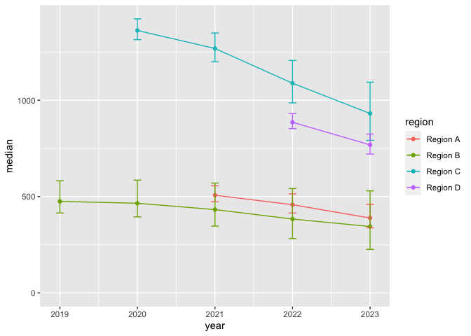
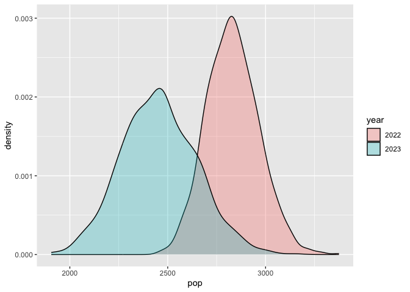

Kodbilaga för bestämning av svenska björnpopulationens storlek
================

Detta kodbibliotek har ambitionen att redovisa snarare än att närmare
förklara utförda beräkningar. Kod och data kan installeras som ett
R-paket med

``` r
# Vid behov installera paketet devtools med install.packages("devtools)
devtools::install_github("https://github.com/mskoldSU/BjornSE2022")
```

``` r
library(tidyverse) # Installera med install.packages("tidyverse") vid behov
library(BjornSE2022)
```

## Data

Beräkningarna utgår från spillningsprover från de individer som utgör
underlag för populationsuppskattningen i varje inventeringsområde
inventeringsåret. Detta omfattar samtliga påträffade individer som är
könsbestämda och bedömts tillhöra inventeringsområdet, undantaget de som
är bekräftat fällda under inventeringsårets licensjakt. Endast
insamlingsdatum och individ används i beräkningarna av
populationsstorlek. data är tillgängligt i paketet som en tabell
`spillning`

``` r
head(spillning)
```

    ##         id  sex       date        survey
    ## 1 BI050197 Hona 2019-08-22 Region B 2019
    ## 2 BI414849 Hane 2019-08-21 Region B 2019
    ## 3 BI414869 Hona 2019-08-21 Region B 2019
    ## 4 BI414971 Hane 2019-08-21 Region B 2019
    ## 5 BI080579 Hane 2019-08-22 Region B 2019
    ## 6 BI080579 Hane 2019-08-23 Region B 2019

## Populationsuppskattningar

De publicerade regionala populationsuppskattningarna bygger på samtliga
individer. Här uppskattas populationerna med samma metodik, men utan
gränsbjörnar och björnar fällda vid jakt. Metoderna beskrivs närmare i
den senaste inventeringsrapporten
([länk](http://www.diva-portal.org/smash/get/diva2:1786619/FULLTEXT01.pdf))
och i form av kod på <https://github.com/mskoldSU/Bjorn2022>. Utan
närmare beskrivning uppskattas populationsstorlekarna med MARK genom
gränssnittet RMark

``` r
model_fits <- spillning |> 
  nest_by(survey) |> 
  mutate(fit_mark(data) |> filter(dAICc == 0)) # Anpassa och välj modell med lägst AICc
```

    ## Warning: There were 3 warnings in `mutate()`.
    ## The first warning was:
    ## ℹ In argument: `filter(fit_mark(data), dAICc == 0)`.
    ## ℹ In row 4.
    ## Caused by warning in `data.frame()`:
    ## ! NAs introduced by coercion
    ## ℹ Run `dplyr::last_dplyr_warnings()` to see the 2 remaining warnings.

Resultaten sammanfattas i tabellform med

``` r
model_fits |> mutate(result = paste0(nfm, " (", round(nfm_l), ", ", round(nfm_u), ")")) |> 
  select(survey, result) |> 
  knitr::kable()
```

| survey        | result            |
|:--------------|:------------------|
| Region A 2021 | 506 (462, 554)    |
| Region B 2019 | 475 (389, 581)    |
| Region C 2020 | 1364 (1298, 1433) |
| Region D 2022 | 885 (840, 932)    |

## Framräkning

Baserat på dessa uppskattningar räknas sedan populationerna fram till
ett gemensamt år. Detta görs genom att först som startvärde dra
områdesvisa populationsstorleker från de anpassade modellernas
osäkerhetsfördelning (parametrisk bootstrap), multiplicera dem med en
normalfördelad naturlig ökningstakt (N(1.12, 0.0004)) som är samma för
alla regioner och år, sedan dra ifrån rapporterat antal individer
skjutna som del av skydds- eller licensjakt. Jaktdata finns tillgängligt
i tabellen `jakt`

``` r
jakt
```

    ##    year   region hunted
    ## 1  2019 Region A     46
    ## 2  2019 Region B     31
    ## 3  2019 Region C    141
    ## 4  2019 Region D    105
    ## 5  2020 Region A     78
    ## 6  2020 Region B     68
    ## 7  2020 Region C    167
    ## 8  2020 Region D    109
    ## 9  2021 Region A     78
    ## 10 2021 Region B     91
    ## 11 2021 Region C    259
    ## 12 2021 Region D    125
    ## 13 2022 Region A    111
    ## 14 2022 Region B    101
    ## 15 2022 Region C    335
    ## 16 2022 Region D    170
    ## 17 2023 Region A    123
    ## 18 2023 Region B     86
    ## 19 2023 Region C    286
    ## 20 2023 Region D    225

Allt räknas fram med funktionen `forward`, som i två upprepningar ger

``` r
forward(model_fits, rnorm(1, 1.12, 0.02), jakt)
```

    ## # A tibble: 14 × 4
    ##    region    year hunted   pop
    ##    <chr>    <dbl>  <int> <dbl>
    ##  1 Region A  2021     78  506.
    ##  2 Region A  2022    111  445.
    ##  3 Region A  2023    123  365.
    ##  4 Region B  2019     31  555.
    ##  5 Region B  2020     68  542.
    ##  6 Region B  2021     91  504.
    ##  7 Region B  2022    101  452.
    ##  8 Region B  2023     86  410.
    ##  9 Region C  2020    167 1375.
    ## 10 Region C  2021    259 1251.
    ## 11 Region C  2022    335 1038.
    ## 12 Region C  2023    286  854.
    ## 13 Region D  2022    170  873.
    ## 14 Region D  2023    225  733.

och

``` r
forward(model_fits, rnorm(1, 1.12, 0.02), jakt)
```

    ## # A tibble: 14 × 4
    ##    region    year hunted   pop
    ##    <chr>    <dbl>  <int> <dbl>
    ##  1 Region A  2021     78  493.
    ##  2 Region A  2022    111  426.
    ##  3 Region A  2023    123  342.
    ##  4 Region B  2019     31  465.
    ##  5 Region B  2020     68  439.
    ##  6 Region B  2021     91  387.
    ##  7 Region B  2022    101  321.
    ##  8 Region B  2023     86  264.
    ##  9 Region C  2020    167 1388.
    ## 10 Region C  2021    259 1255.
    ## 11 Region C  2022    335 1033.
    ## 12 Region C  2023    286  841.
    ## 13 Region D  2022    170  897.
    ## 14 Region D  2023    225  753.

Slutligen upprepas allt ett stort antal gånger (här 1000) och
sammanfattas i en graf

``` r
sims <- map_df(1:1000, 
               function(x) forward(model_fits, rnorm(1, 1.12, .02), jakt) |>
                 mutate(id = x))
resultat <- sims |> 
  summarise(median = quantile(pop, prob = .5),
            upper = quantile(pop, prob = .95),
            lower = quantile(pop, prob = .05),
            .by = c("year", "region"))
resultat |> ggplot(aes(x = year, color = region)) +
  geom_line(aes(y = median)) + 
  geom_point(aes(y = median)) +
  geom_errorbar(aes(ymin = lower, ymax = upper), width = .1) +
  scale_y_continuous(limits = c(0, NA))
```

<!-- -->

och med nationella populationsstorlekar 2022 och 2023

``` r
sims |> filter(year %in% c(2022, 2023)) |> 
  summarise(pop = sum(pop), .by = c("year", "id")) |> 
  mutate(year = as.factor(year)) |> 
  ggplot(aes(x = pop, fill = year)) + geom_density(alpha = .3)
```

<!-- -->

``` r
sessionInfo()
```

    ## R version 4.2.3 (2023-03-15)
    ## Platform: x86_64-apple-darwin17.0 (64-bit)
    ## Running under: macOS Big Sur ... 10.16
    ## 
    ## Matrix products: default
    ## BLAS:   /Library/Frameworks/R.framework/Versions/4.2/Resources/lib/libRblas.0.dylib
    ## LAPACK: /Library/Frameworks/R.framework/Versions/4.2/Resources/lib/libRlapack.dylib
    ## 
    ## locale:
    ## [1] en_US.UTF-8/en_US.UTF-8/en_US.UTF-8/C/en_US.UTF-8/en_US.UTF-8
    ## 
    ## attached base packages:
    ## [1] stats     graphics  grDevices utils     datasets  methods   base     
    ## 
    ## other attached packages:
    ##  [1] BjornSE2022_0.1.0 lubridate_1.9.2   forcats_1.0.0     stringr_1.5.0    
    ##  [5] dplyr_1.1.1       purrr_1.0.1       readr_2.1.4       tidyr_1.3.0      
    ##  [9] tibble_3.2.1      ggplot2_3.4.1     tidyverse_2.0.0  
    ## 
    ## loaded via a namespace (and not attached):
    ##  [1] tidyselect_1.2.0 xfun_0.38        splines_4.2.3    lattice_0.20-45 
    ##  [5] colorspace_2.1-0 vctrs_0.6.1      generics_0.1.3   expm_0.999-7    
    ##  [9] htmltools_0.5.5  yaml_2.3.7       utf8_1.2.3       survival_3.5-5  
    ## [13] rlang_1.1.0      pillar_1.9.0     glue_1.6.2       withr_2.5.0     
    ## [17] lifecycle_1.0.3  munsell_0.5.0    gtable_0.3.3     mvtnorm_1.1-3   
    ## [21] coda_0.19-4      evaluate_0.20    labeling_0.4.2   knitr_1.42      
    ## [25] tzdb_0.3.0       fastmap_1.1.1    parallel_4.2.3   fansi_1.0.4     
    ## [29] highr_0.10       scales_1.2.1     RMark_3.0.0      farver_2.1.1    
    ## [33] hms_1.1.3        digest_0.6.31    stringi_1.7.12   msm_1.7         
    ## [37] grid_4.2.3       cli_3.6.1        tools_4.2.3      magrittr_2.0.3  
    ## [41] pkgconfig_2.0.3  MASS_7.3-58.3    Matrix_1.5-3     matrixcalc_1.0-6
    ## [45] timechange_0.2.0 rmarkdown_2.21   rstudioapi_0.14  R6_2.5.1        
    ## [49] compiler_4.2.3
